# Lab 200: High Availability for the OsCommerce instance 

## Introduction
Below, we have a demo of how you can setup disaster recovery for your app easily in cloud leveraging different availability domains (or across regions). One of the key principles of designing high availability solutions is to avoid single point of failure.
 We will deploy Compute instances that perform the same tasks in multiple availability domains. You can use the custom image you used for primary compute instance to deploy secondary compute instance. This design removes a single point of failure by introducing redundancy. The following diagram illustrates how we can achieve high availability.


### Objectives

* Learn how to leverage Oracle Cloud infrastructure to create a high available and disaster recovery solution for your applications.
* Learn how to replicate data across multiple compute instances using Rsync, mysqldump utility.
* Learn how to provision and configure DNS Failover with Traffic Management Steering policy


### Required Artifacts
* 2 OsCommerce compute servers (You already have primary oscommerce compute instance. Spin up a secondary compute instance from your oscommerce custom image)
* Make sure you have setup ssh access from local to both the servers and from primary server to secondary server and vice-versa (More information in the lab below)
* 1 Domain name (To demonstrate failover)

Estimated time to complete this lab is three hours.

### Additional Resources
* To learn about provisioning Networks and Network Security check out this [link](https://docs.cloud.oracle.com/en-us/iaas/Content/Network/Concepts/overview.htm)

* To learn about Oracle's DNS and Traffic Management check out this [link](https://docs.cloud.oracle.com/en-us/iaas/Content/EdgeServices/overview.htm)


## Part 1. Transfer and synchronize webserver files and database files between primary instance and secondary instance.

### Step 1: Download and installing rsync
Download rsync command on both the compute instances as follows:

``` 
sudo apt-get install rsync
```

### Step 2: Scp ssh key to primary compute OR Generate ssh key pair

As written in the pre-reqs make sure you have setup ssh access from primary server to secondary server and vice-versa. If you want to use the same ssh keys as the one you are using to ssh into oscommerce compute, you can scp the private key file from local to primary oscommerce instance by using the following:


Alternatively, we can use: Method 2 - Create new keys

On each server run:

```
ssh-keygen
```

Hit enter. You'll have two files:

.ssh/id_rsa & .ssh/id_rsa.pub

On Server A, cat and copy to clipboard the public key:

```
cat ~/.ssh/id_rsa.pub
```

select and copy to your clipboard

ssh into Server B, and append the contents of that to the it's authorized_keys file:

```
cat >> ~/.ssh/authorized_keys
```

Paste your clipboard contents. Rsync is configured to use ssh by default**

### Step 3: Replicate web server files and database files

Our web server files are located at /var/www/html. In order to demonstrate replication of web server files from primary server to secondary server, lets delete all the web server files from secondary server and then set up a replication from primary server using rsync.

On secondary server, run the following command.

```
sudo rm -rf /var/www/html
```

This will delete all the web server files from secondary server. Now, go to /var/www folder and create an empty folder:

```
sudo mkdir html
```

Now give the following permissions to the folder:

```
sudo chmod 777 /var/www/html/
```

Please note: For the purpose of this lab, we are using chmod 777, however setting up 777 permissions is not recommended for production environments. Here, we are using it to quickly demonstrate replication and failover.


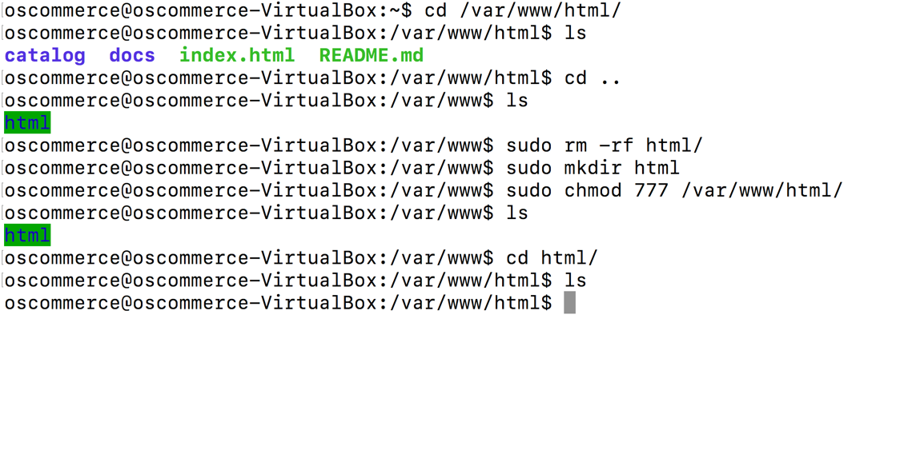

Now, we will perform the rsync command from primary server to secondary server to replicate the files. Run the following command on server 1 (primary). The ip address below is for the secondary server.

```
rsync -r /var/www/html/ oscommerce@129.146.108.71:/var/www/html/
```

If you go to secondary server, you can see the following files in the /var/www/html directory


We have successfully replicated the web server files. Similaryly, we can replicate the mysql files as well. We can do this in many ways:
* Using rsync as above
*	Using mysql dump utility
*	Using Golden Gate image in OCI [Learn more](https://blogs.oracle.com/dataintegration/done-cancel-v12)


### Step 4: Replicate mysql database files

Run the following command on primary and backup server:

```
sudo nano /etc/my.cnf
```


If the above command does not work, try the following command.

```
sudo nano /etc/mysql/my.cnf
```


Comment out the line which says

```
bind-address = 127.0.0.1
```

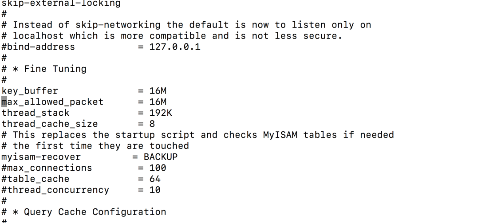


Restart mysql

```
sudo service mysql restart
```

In order for our database in our secondary server to communicate to the database in the primary server, do the following in the primary server- Go to mysql terminal by typing:

```
mysql -u root -p
```

On mysql terminal, run the following commands:

```
CREATE USER 'root'@'ip_address' IDENTIFIED BY 'some_pass';
```

```
GRANT ALL PRIVILEGES ON *.* TO 'root'@'ip_address';
```

**Note: ip_address is the ip address of the secondary server**

Now, go to the secondary server:

Delete the oscommerce database and create an empty oscommerce database as follows: 

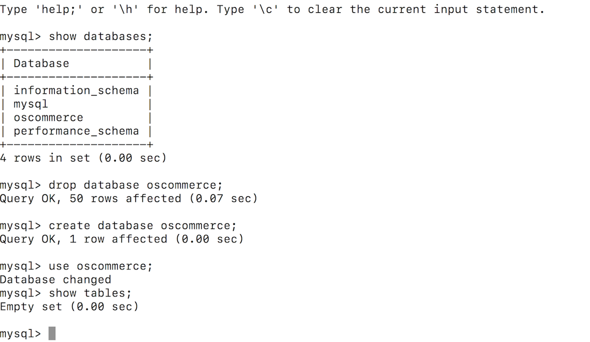

Now run the following command to replicate the database


Note: Run this command in  VM terminal and not in mysql terminal. 

```
 mysqldump --host=1.2.3.4 --user=MYDBUSER -pMYDBPASSWORD --add-drop-table --no-create-db --skip-lock-tables MYDBNAME | mysql --user=MYDBUSER -pMYDBPASSWORD MYDBNAME
 ```

In my case, the command looked like this:

```
mysqldump --host=150.136.116.169 -P 3306 --user=root -poscommerce --add-drop-table --no-create-db --skip-lock-tables oscommerce | mysql --user=root -poscommerce oscommerce
```

Check if the database tables are replicated properly by using the following:


Note this particular mysqldump command does not create a dump file, but rather migrates all tables of the specified database from source to the target thereby keeping the source and target database consistent. 

For production environments, you can run it as a cronjob. Run ‘crontab -e’, then add your mysqldump command:

```
0 0 * * * mysqldump...
```

Thus, we have the webserver files as well as the database files in a secondary server safe and with latest updates. Furthermore, we can setup cron jobs for automation rather than running the rsync and mysqldump commands manually every time.

## Part 2. Configure DNS failover
At this point of time, our primary server and secondary server are in sync. Lets proceed and configure the failover from the Oracle Cloud console. There are multiple ways to setup a failover like using keepalived, using load balancers and using DNS Traffic Management Steering policies in OCI. For the purpose of this lab, we will use the DNS Traffic Management Steering Policy in Oracle Cloud Infrastructure.

### Step 1:Login into both primary and secondary servers

ssh into both compute instances

```
ssh oscommerce@<public ip-add>
```

Edit Apache config file. This step would make the oscommerce application accessible directly on the public ip address.

```
sudo nano /etc/apache2/sites-available/000-default.conf
```

Change from ```"DocumentRoot /var/www/html" ```to ```"DocumentRoot /var/www/html/catalog"```

Add 

```
“DirectoryIndex index.php”
```

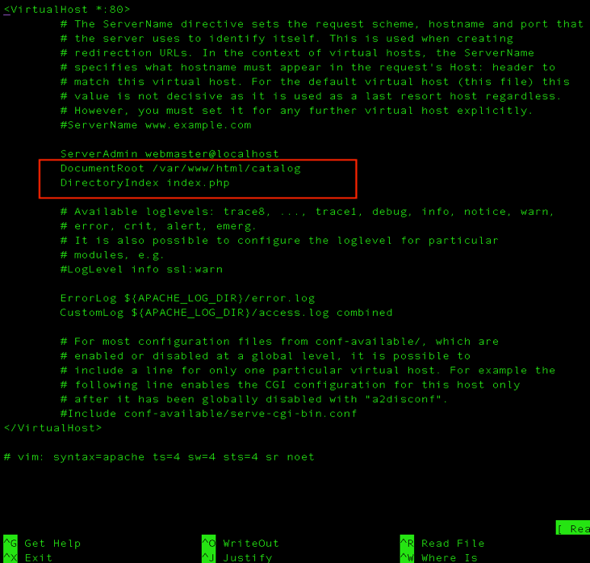

Restart the server using the command

```
sudo service apache2 restart
```

### If you already have your DNS Zone within Oracle Cloud Infrastructure, Skip step 2 and step 3

### Step 2: Export DNS zone file

**Prequisite**

* For this section of a lab, you will need domain name. There are many domain name registrars like GoDaddy, NameCheap or Google, where you will be able to purchase domain names for about 2-3$. We are using Google as the domain name registrar for this lab. Any domain name should work for this exercise, hence, you can pick one of the cheaper domain names. 

* If you do not have a domain name, you can skim over steps 2,3 and 4 and directly move to step 5. In step 5 you should be able to monitor your instances health.

* Refer the following Youtube links for steps to create DNS failover -

* [What is DNS?](https://www.youtube.com/watch?v=SnMumcIE1aw)
* [DNS overview & Demo](https://www.youtube.com/watch?v=dfKeDh79HdQ)

* Note: DNS will take 4-12 hours to propagate after you make changes**

Export the resource record. This file would be exported as a .txt file. Store in a secure location, we would need the file later in the lab

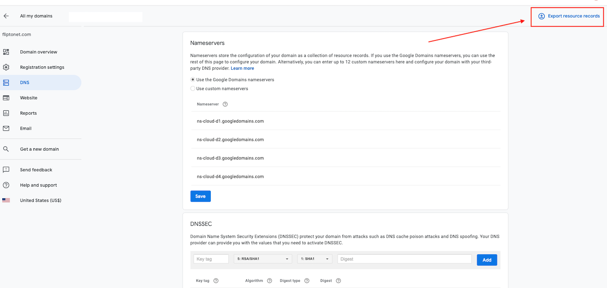


### Step 3: Create Zone on Oracle Cloud infrastructure
In this step, you will create a zone. A zone holds the trusted DNS records that will reside on Oracle Cloud Infrastructure’s nameservers.

Navigate back to OCI console to create a zone using the exported file


Import file and create zone  
Import - Drag and drop, select, or paste a valid zone file into the Import Zone File window. The zone is imported as a primary zone.


Navigate into the zone you just created


To make your Oracle Cloud Infrastructure hosted zone accessible through the internet, you must delegate your domain with your domain's registrar. to do that:

Open the navigation menu. Under Core Infrastructure, go to Networking and click DNS Zone Management. Click the Zone Name for the zone you want to delegate.

Use the Type sort filter to locate the NS records for your zone.

Note the name servers. You can use the noted name servers to change your domain's DNS delegation. Refer to your registrar's documentation for instructions.


I’m using google-domain in this case. Add name servers to your domain name server’s management console as shown below 

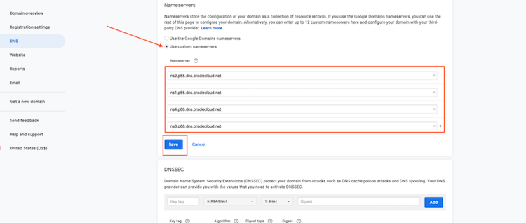


### Step 4: Add an "A" record to DNS zone

There are many record types you can add to your zone, depending on your goals for the zone and its DNS management. For this Lab, we would add an “A” record. For more information about record types go to Supported Resource Records (https://docs.cloud.oracle.com/en-us/iaas/Content/DNS/Tasks/managingdnszones.htm)

Navigate back to Oracle cloud console, open the navigation menu. Under Core Infrastructure, go to Networking and click DNS Zone Management.


Click the Zone Name in which you want to add a record. Zone details and a list of records appear. Click Add Record.

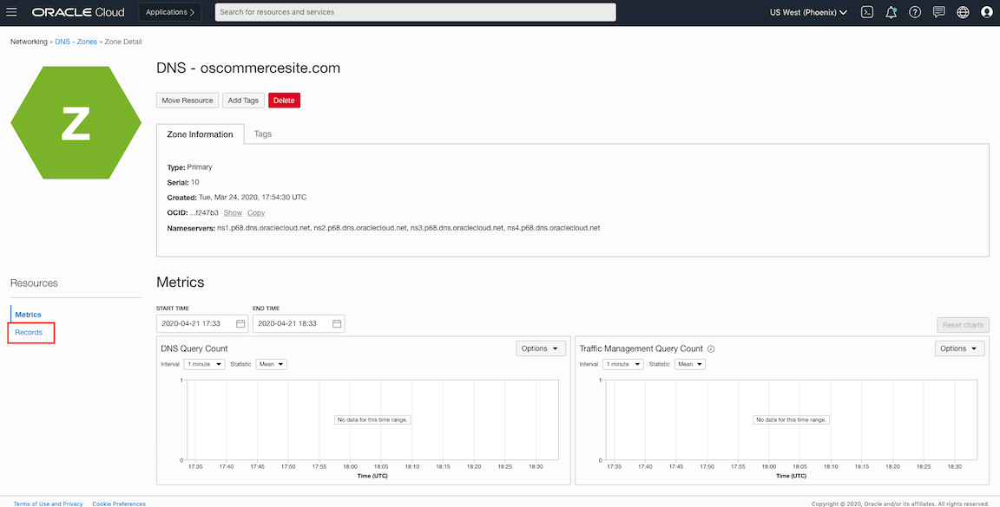


In the Add Record dialog box, select a record type from the drop-down list, and then enter the information for the record. Under address, enter the public address of your primary server  

Note the "NAME" box, this where you would create a sub-domain name that would be used later in this lab

Click Submit.

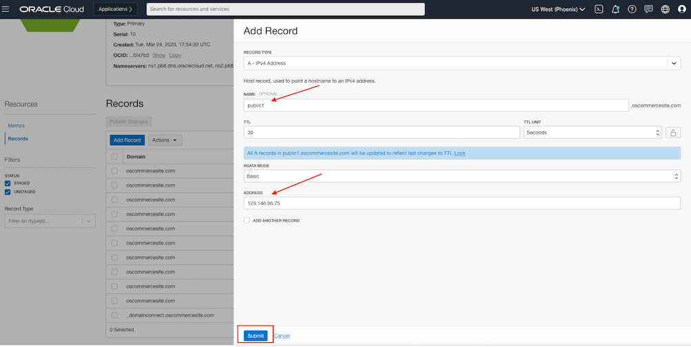
 
Once your records have been added, click Publish Changes.

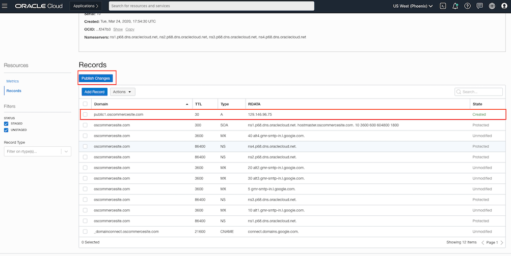

In the confirmation dialog box, click Publish Changes.


### Step 5: Create a failover traffic steering policy on OCI console

Traffic Management Steering Policies enables you to configure policies to serve intelligent responses to DNS queries, meaning different answers (endpoints) may be served for the query depending on the logic you define in the policy. Traffic Management Steering Policies can account for health of answers to provide failover capabilities

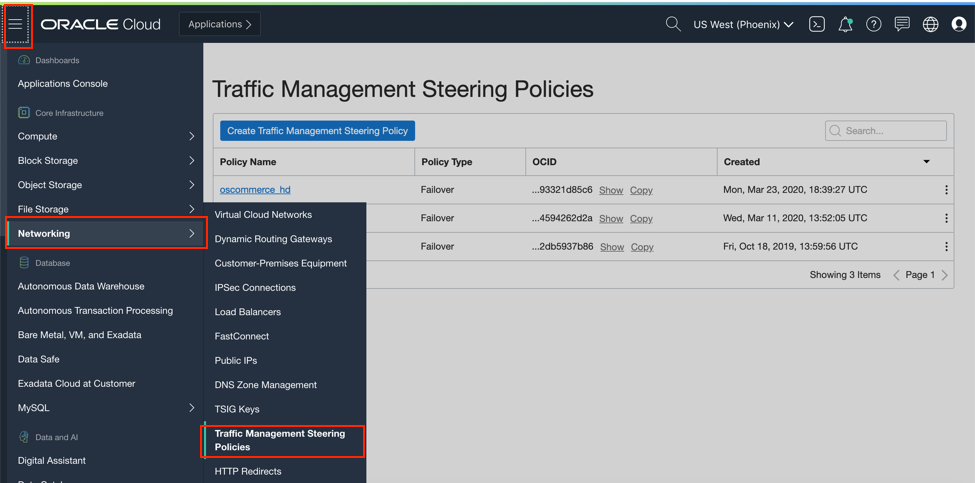


There are other options here so make sure to select “failover”

Failover policies allow you to prioritize the order in which you want answers served in a policy (for example, Primary and Secondary). Oracle Cloud Infrastructure Health Checks are leveraged to determine the health of answers in the policy. If the Primary Answer is determined to be unhealthy, DNS traffic will automatically be steered to the Secondary Answer.


Configure the answer pools by filling in the name and public ip address of the OsCommerce compute instance. In my case I have a pool of 2 compute instances


Set the priority of the pools you created in the previous step
Pool Priority: Failover priority rules specify the priority of answers that are served in a policy. If the primary answer is unavailable, traffic is steered to the next answer in the list.


Create Health Check.

A health check is a test to confirm the availability of backend servers. A health check can be a request or a connection attempt

In the Create Health Check dialog box, enter the following:
- Health Check Name: The name used for the health check. Avoid entering confidential information.
- Interval: Select the period of time between health checks of the target.
- Protocol: The network protocol used to interact with your endpoint, such as HTTP protocol, which initializes an HTTP handshake with your endpoint.
- Port: The port for the monitor to look for a connection. The default is port 80 for HTTP. For HTTPS, use port 443.
- Path: The specific path on the target to be monitored.
- Method: Select the HTTP method used for the health check.
- Timeout: Select the maximum time to wait for a reply before marking the health check as failed.


Attached the sub-domain name you create earlier to the policy


Once you've created traffic management steering policy, Click on overview.make sure health status are "Healthy"


With a  web browser, access the oscommerce application using the sub-domain name 

Example: "public1.oscommercesite.com"

Test the failover mechanism by stopping apache2 service on the mater node

Login into the master node and stop apache service

```
sudo /etc/init.d/apache2 stop
```


Check the failover policy overview, the master node’s heath-check status should have changed from “healthy” to “unhealthy “

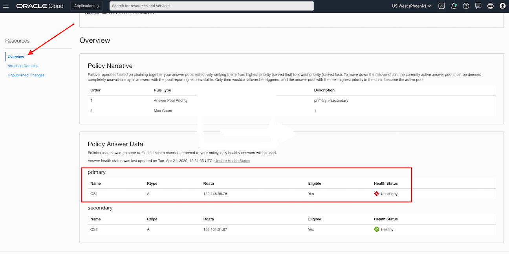
