# Lab 400: Installing an Agent with Oracle Management Cloud

## Introduction
This lab will walk you through the process on how to install an agent onto an existing application on the cloud. First, you will download the agent, then move it to your virtual machine with the app from Lab 100, and unzip it. After we confirm the agent is monitoring the application, we will then utilize entity discovery to better monitor the MySQL database in the environment.

### Objectives
* Learn how to install, move and unzip cloud agents
* Understand some of the dashboards that can be created with OMC
* Learn how the entity discovery process works

### Required Artifacts
* The following lab requires an Oracle Public Cloud account. You may use your own cloud account, a cloud account that you obtained through a trial, or a training account whose details were given to you by an Oracle instructor.
* [VirtualBox](https://www.virtualbox.org/wiki/Downloads)
* [CyberDuck](https://cyberduck.io/)
* A compute image with the third party application from Lab 100 installed

Estimated time to complete this lab is 75 minutes

### Additional Resources
* Add OMC Documentation here

## Part 1. Downloading the Agent from Oracle Management Cloud

### Step 1: Navigate to the Agents Page
Open Oracle Management Cloud and on the menu on the left hand side of your screen, click "Administration -> Agents" to get to the agents page.

Once here, click the hamburger menu on the top right hand side of the screen and click the download agent button.

 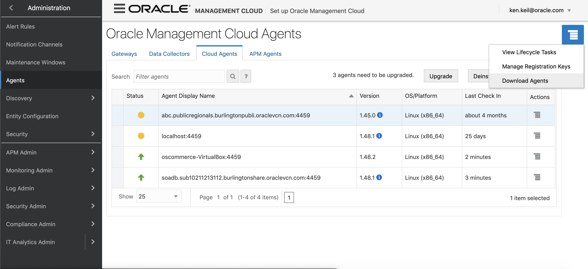

### Step 2: Download the agent
For agent type, select "Cloud Agent" and for your operating system choose "Linux (64 Bit)"

Download the "Cloud Agent - Linux (64-bit)" file and save it to your computer.

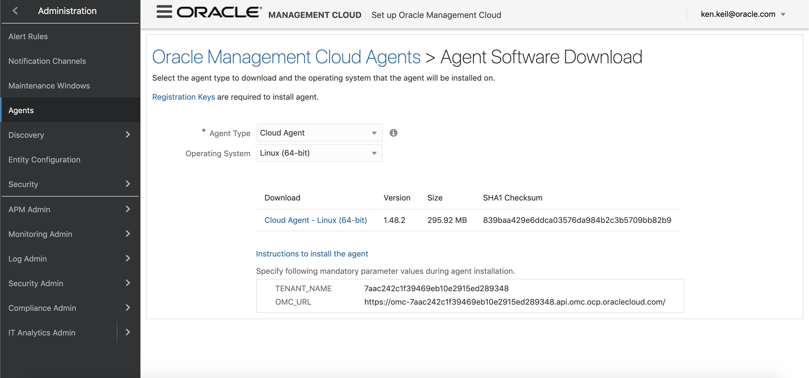
 
**Take note of your tenant name and OMC URL, you will need these later.**

 

## Part 2: Moving and Unzipping the Agent

### Step 1: Installing Cyberduck

 Download the appropriate version of [Cyberduck](https://cyberduck.io/download/) for your system.

### Step 2 Connecting to your Application

Open Cyberduck. If prompted to “Set Cyberduck as default application for FTP and SFTP locations” click cancel.

Click the button of the globe with the + sign. In the dropdown menu at the top, change it to SFTP (SSH File Transfer Protocol).

For your server, navigate to your OSCommerce Compute Instance, and copy the public IP Address.


Username and password should both be "oscommerce" by default.

For SSH Private Key, simply select your private key from the drop down menu, then click connect.

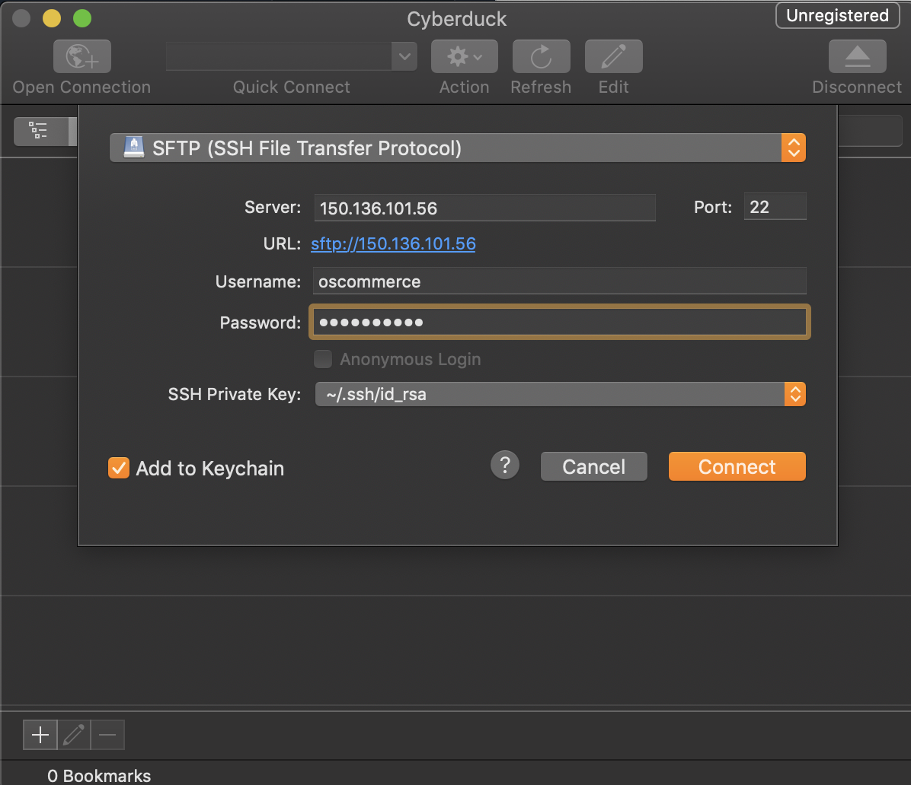
 
Allow any unknown finger prints.

Once connected, you should see the home directory for oscommerce. Simply drag your downloaded cloudagent_linux zip file into the home directory. Please note, **the file must still be zipped.**

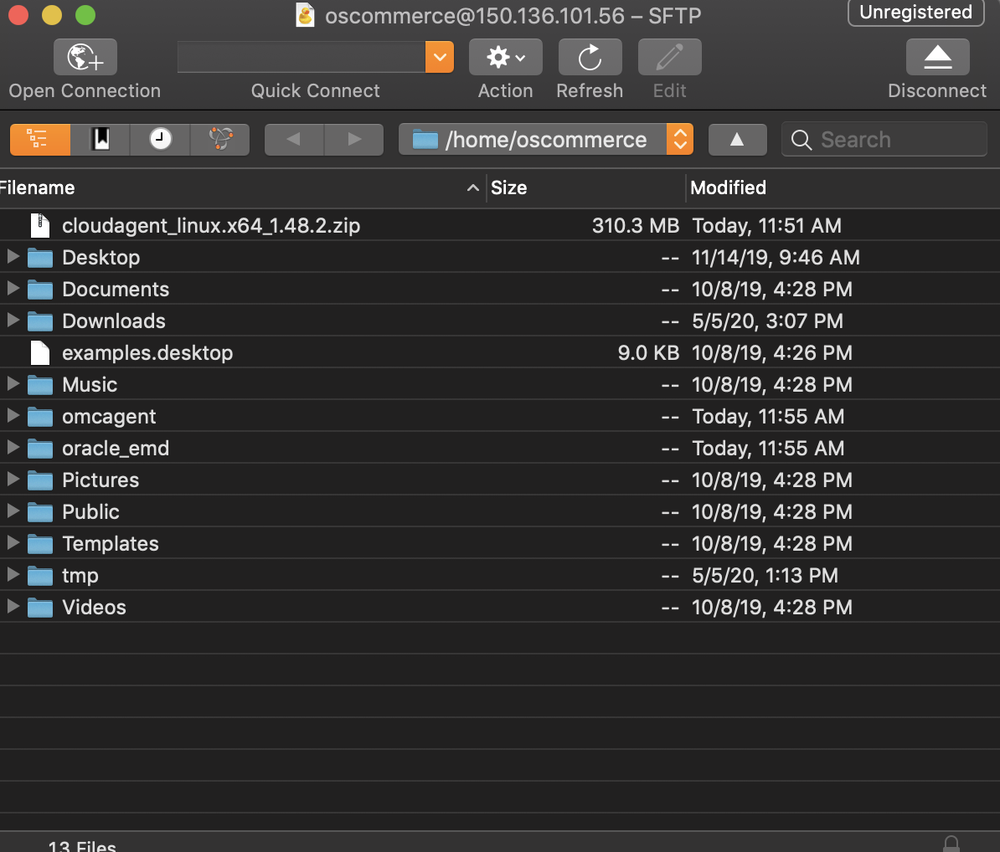

### Step 3: Unzipping the Agent

Open your terminal and type ```cd .ssh``` to change to your ssh directory.

Once here connect to your oscommerce instance by typing the following command:
```ssh oscommerce@<YourPublicIPHere>```

**Replace ‘$\lt$YourPublicIPHere$\gt$’ with the public IP on your instance** 

If told the authenticity of the host can’t be established, type yes to continue.

You then will need to enter your password. By default this is oscommerce.
 
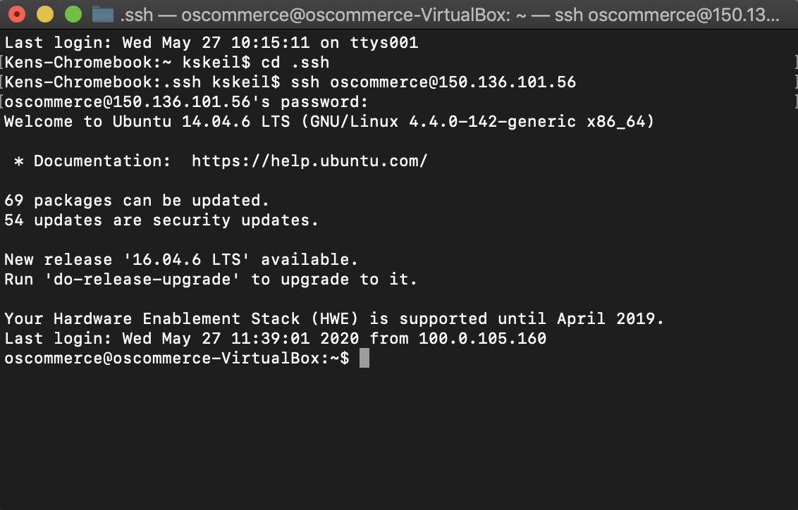

Type the command ```ls``` to confirm the cloudagent_linux zip file is still there.

Unzip the file by typing:
```unzip cloudagent_linux.64x.48.2.zip```

**Note: Your file name may appear slightly different. For a shortcut, type in ‘unzip cloudagent’ then press tab to auto complete to the correct file name.**

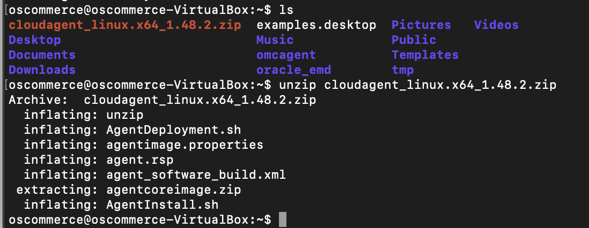

If you type ```ls``` again, you should see some additional files in your directory. The "agent.rsp" file is the one we’re currently interested in.

Use your favorite text editor to open the file. In this case, I’m using the command ```nano agent.rsp```

Fill in the tenant name with the details your wrote down in Part 1 Step 2. 

For the registration key use:
```RKsjm7eGyt9igutkdn-RcULYZR```

For agent base directory type:
```/home/oscommerce/omcagent/agent_inst/bin```

And finally, populate the OMC_URL with the url saved in Part 1 Step 2.

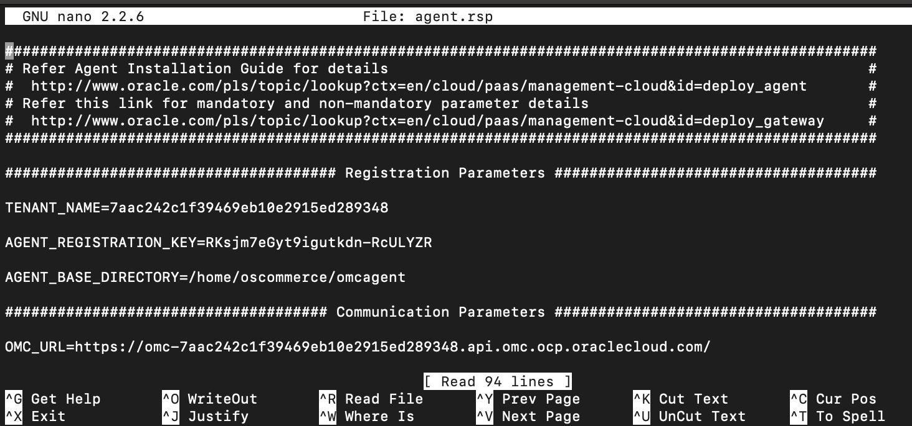 

Save any changes and exit out. In our case, we type Control + X to exit, type Y to save, then enter.

Next, we’ll execute one of the scripts, by typing:
```./AgentInstall.sh```

 

To check if this complete properly, change to the bin directory by typing:
```cd omcagent/agent_inst/bin/```

From here, you can check the status of your agent by typing: ```./omcli status agent```

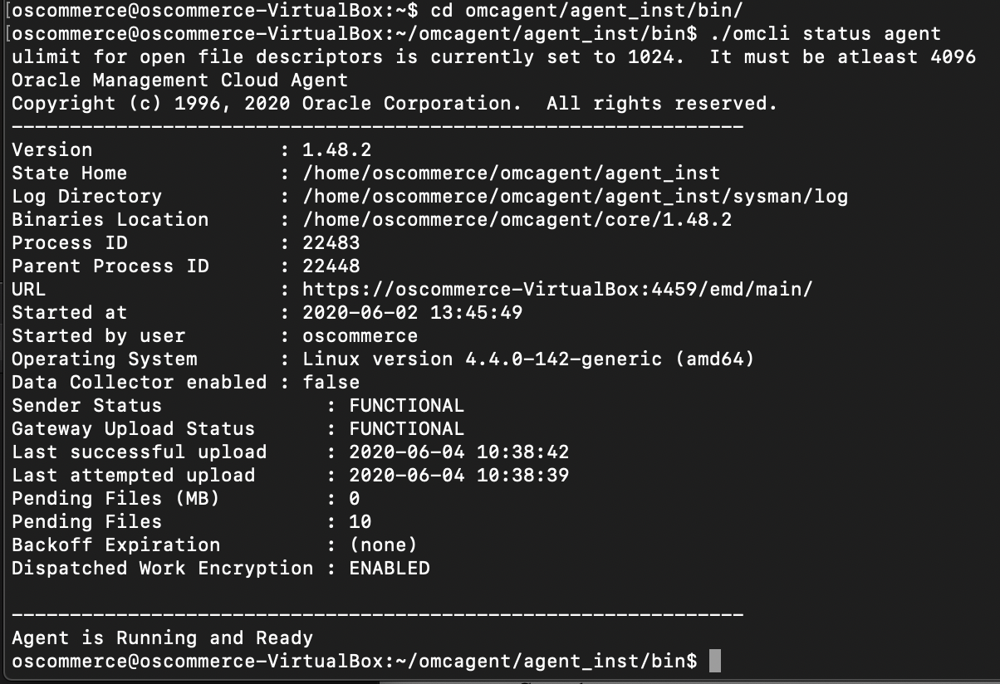 

### Step 4: Confirming the Agent is Running
Open OMC and navigate to agents by accessing the menu on the left hand side of your screen and clicking Administration -> Agents.

At the bar at the top, click Cloud Agents, and you should see your Virtual Box Agent up and running.

To monitor your agent, click the hamburger menu on the right hand side of the agent and click "view in monitoring"

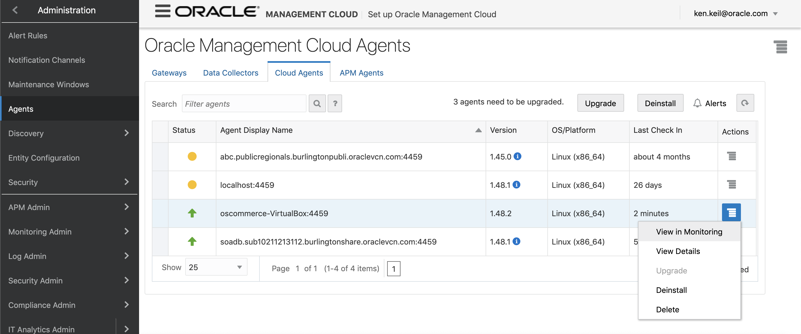

## Part 3: Discovering MySQL

### Step 1: Configuring MySQL

SSH into your instance if you aren't already there.

Type the command ```mysql -u root -p``` to connect to your MySQL database.

When prompted for a password, type in the root password from the initial setup in Lab 100. In the case, my password was 'oscommerce'.

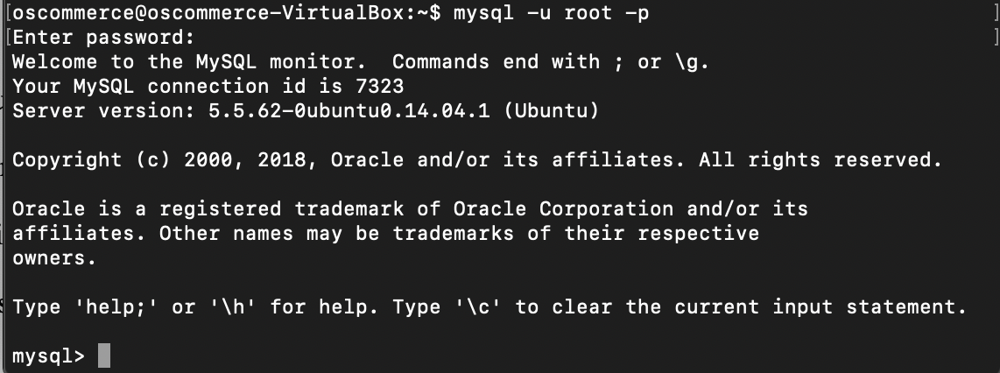

Once here, we need to create a user for OMC to use, and give it the appropriate permissions.

To create the user, type the command:
```CREATE USER 'moncs’@'l oscommerce-VirtualBox' IDENTIFIED BY '<yourpasswordhere>';```

Replace '$\lt$yourpasswordhere$\gt$' with a password you can remember. You will need this later.

Next, you must give the moncs user appropriate permissions. To do this, type the commands:
```GRANT SELECT, SHOW DATABASES ON *.* TO 'moncs'@'oscommerce-virtualbox ' IDENTIFIED BY '<yourpasswordhere>'; ```

```GRANT SELECT, SHOW DATABASES ON *.* TO ' moncs '@'%' IDENTIFIED BY '<yourpasswordhere>';```

Once again, you will need to replace '$\lt$yourpasswordhere$\gt$' with the password from the create user step.

 

Type 'exit' to exit mysql.

Next, we need to update the config file for MySQL to allow for outside connections. 

First, we need to change to the root directory.

Type the command:
```cd ../```

then again type:
```cd ../```

And finally, to make sure you're in the right folder, type:
```ls```
and confirm you can see the following folder called 'etc'

 

Next, we need to navigate to the MySQL folder, which is inside of etc.

Type the command
```cd etc/mysql/```
to change to this directory.

If we do an ```ls``` here, we should be able to see the my.cnf file.

 

Using your favorite text editor, open up the config file. In my case, I'm doing this by typing the command:

```nano my.cnf```

Once here, we need to scroll down and find 'bind-address'. The value needs to be changed here to 0.0.0.0 to allow all connections.

 

Press Control + X to exit, when prompted to save, type 'Y', and then press enter to confirm.

###Step 2: Agent Discovery

Navigate to Administration -> Discovery

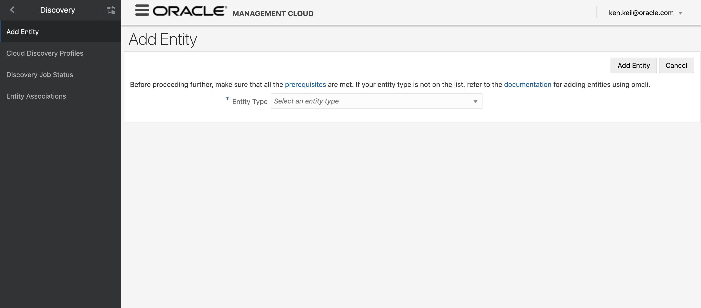 

Under Entity Type, select 'MySQL Database'

Give your entity a unique name.

For JDBC URL, type in ```jdbc:mysql://oscommerce-VirtualBox:3306/mysql```

**NOTE: The JDBC URL is case sensitive**

For hostname, select the virtual box: 'oscommerce-VirtualBox'

For cloud agent, choose the one created, 'oscommerce-VirtualBox:4459'

For user name type 'moncs'

For password type whatever you assigned it to earlier in Part 3 Step 1.

To complete click 'Add Entity'

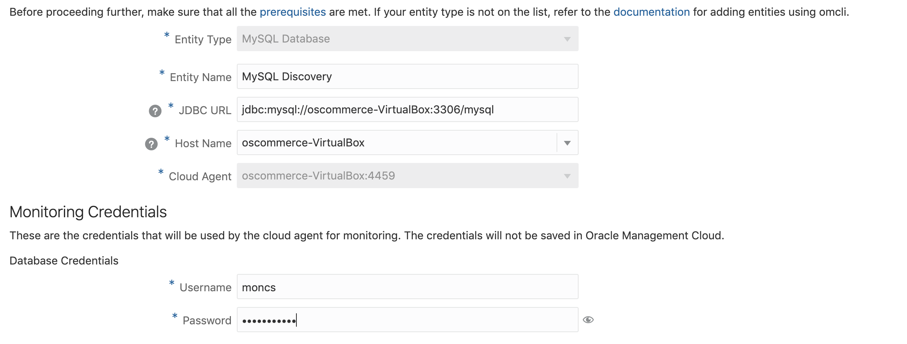 

When asked what to do in the case of errors, select the option 'Stop. You can retry after you fix the errors.'

Wait a minute for the entity to be discovered. After a few moments, you should see the status of your discovery as either success, or success with warnings. If it fails, you need to go back and fix your issue.

 

###Step 3: Creating Dashboards

Now that our agent is installed on the instance, and we have successfully discovered the MySQL Database, it's time to create some useful visualizations and dashboards.

First, head back over to OMC, and on the hamburger menu on the left hand side of the screen, click 'Data Explorer'

On the top of the screen is a bar called the context bar. This will change what entity we are looking to create visualizations on. Always be mindful of what is in the context bar, and the time period on the right of it.

On the context bar, type in
```MySQL```
and select the MySQL Discovery with the matching name to the one you just created.

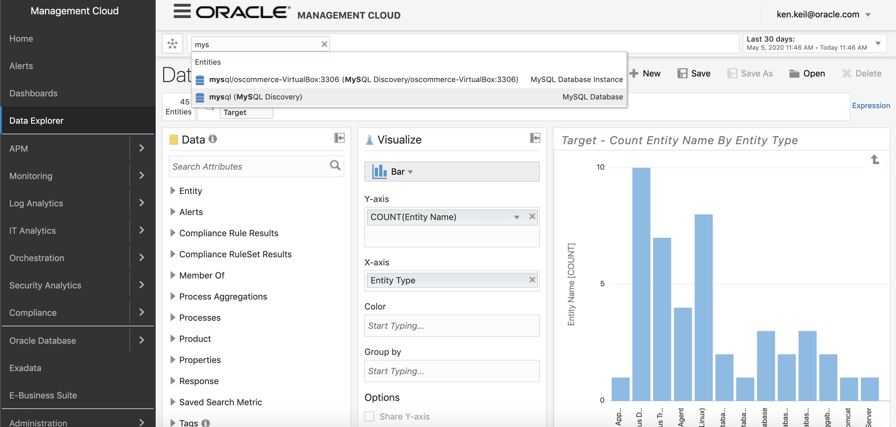 
 
 Now that we're here, let's create a widget that will monitor our CPU Utilization and our Memory Usage.

 First, we need to clear out everything in the Visualize panel by clicking the small x on each of the filters. 

For the graph type, select line chart from the drop down under the visualize panel.

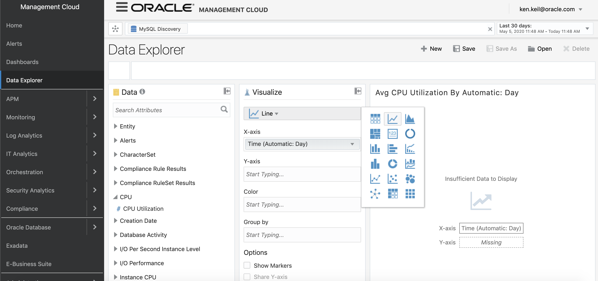 

From the data panel on the left, search for the attribute ```CPU Utilization``` under the tab labeled 'CPU'. 

Drag and drop this over to the Y-Axis.

Your X-axis should now automatically populate with 'Time (Automatic Day)'

Do the same thing for Memory Usage. Under the search bar, type in ```Memory``` and scroll down to find the Physical Memory tab, and drag over 'Memory Usage' to the Y-Axis as well.

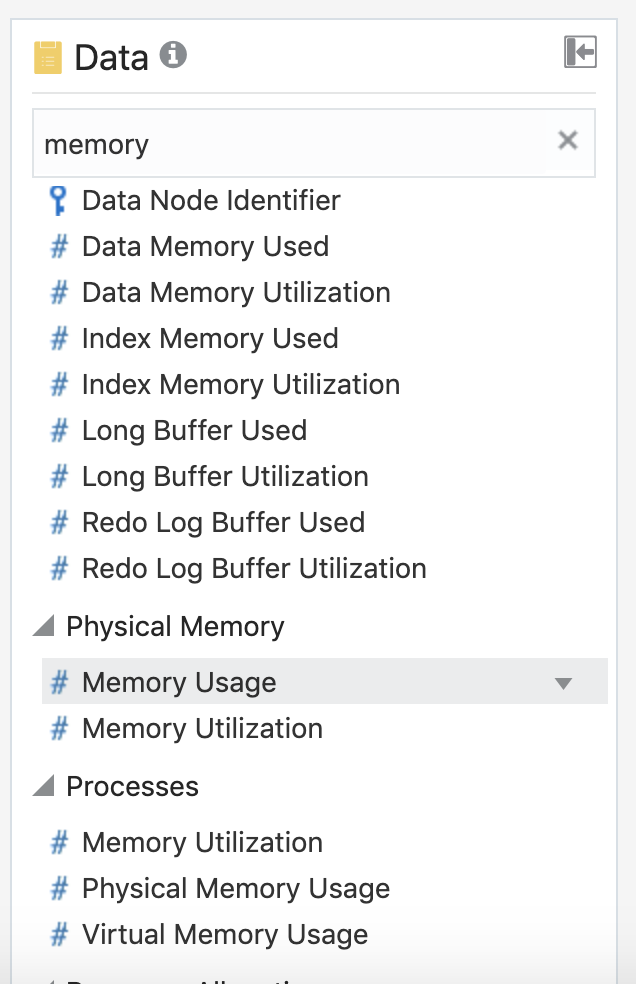 

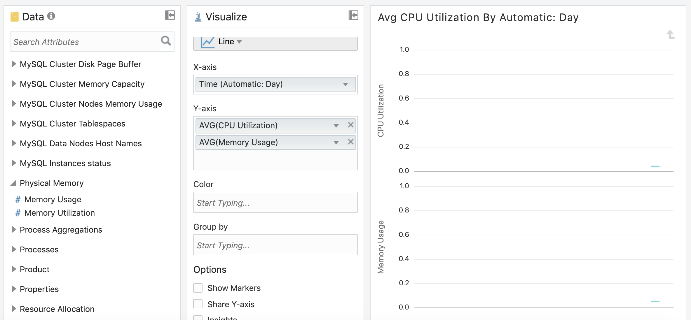 

Don't worry if your graphs look boring or uneventful now. The agent has only just begun collecting data on MySQL, so there's not much to display right now.

This is a great tool to use to create custom, useful dashboards to help provide you with a quick overview of the health of your application.

Let's now go ahead and save this by clicking the save button at the top of the screen. Be sure to give it a name you'll be able to remember.

Navigate over to the Dashboards page from the menu on the left hand side of your screen. 

Click 'Create' at the top of the page.

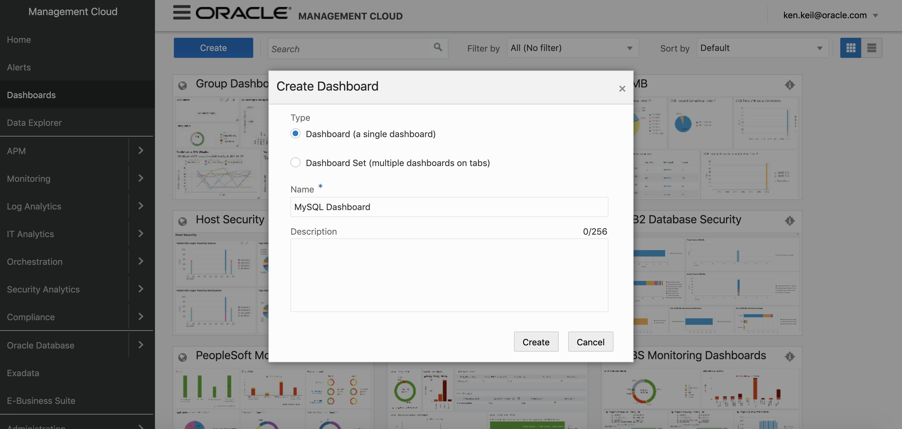 

Once here, at the top of the page, click the edit button. A panel will appear on the right hand side of the screen. 

Search for the widget you just created.

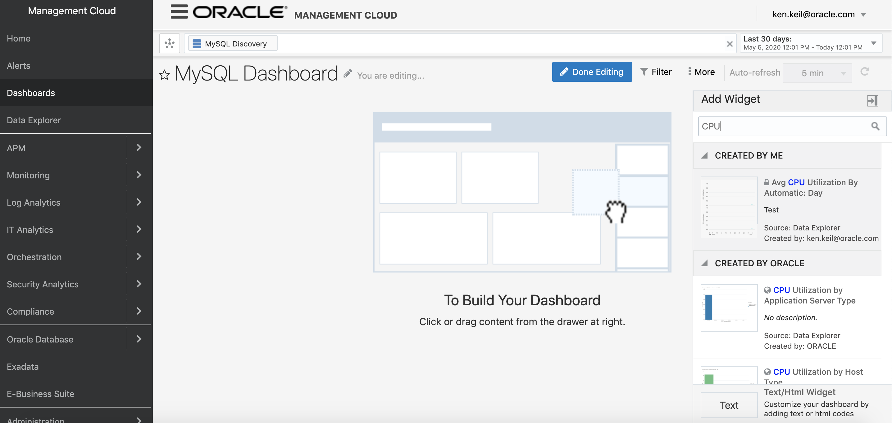 

Click on the widget you just created on the right to add it to the dashboard. Click done editing.

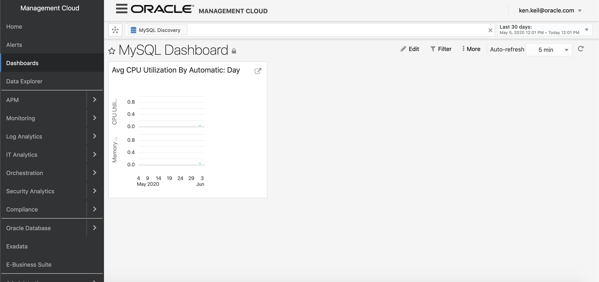 

Congrats! You've just created a functional dashboard monitoring your MySQL database!
